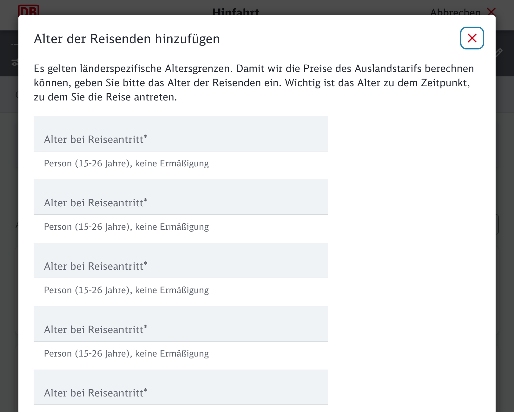

# paste-tabs

Types clipboard contents line-by-line into the focused window, pressing Tab
between lines — for filling forms where each value goes into its own input box
(e.g. `1 <Tab><Tab> 2 <Tab><Tab> 3`).

## Why?

Has this...



...ever happened to you? Now, you can grab your *newline-separated* list of ages from your database, and fill them in with ease.

## Requirements

```bash
pip install pynput
```

(On Linux additionally: `sudo apt install python3-tk python3-dev` and an X
session, or `xdotool`-based Wayland setups; on Windows/macOS pynput is enough.)

## Usage

1. Copy the data to your clipboard (one item per line).
2. Run the tool, click into the first input box of the web page.
3. Wait for the countdown — the script types each line and then presses Tab
   (twice by default) to reach the next input box.

```bash
python3 paste_tabs.py                 # 2 tabs between items, 5s countdown
python3 paste_tabs.py -t 1            # single Tab between items
python3 paste_tabs.py -n 10           # only first 10 lines
python3 paste_tabs.py -d 0.1 -c 10   # slower typing, 10s countdown
```

Before typing each line, the focused field is cleared with
`Cmd+A` / `Ctrl+A` followed by `Backspace`.

**Abort while typing:** move your mouse to a screen corner or press
`Ctrl+C` in the terminal; for a hard stop on macOS, `Cmd+Tab` away first.

## Options

| Flag | Default | Description |
|------|---------|-------------|
| `-t, --tabs` | `2` | Tab presses after each line |
| `-d, --delay` | `0.05` | Seconds between key presses |
| `-c, --countdown` | `5` | Seconds before typing starts |
| `-n, --max-items` | all | Only type the first N lines |

## How it works

Reads the clipboard via `pbpaste` (macOS), the Win32 clipboard API (Windows),
or `shutil.paste`/`xclip` (Linux), then simulates keystrokes with
[pynput](https://pynput.readthedocs.io/). Works on macOS, Windows, and X11
Linux — no browser extension needed.


## License

Completely vibecoded, I don't claim to own any of this, and cannot attach a license to the project. Licensing vibecoded things is hard.
